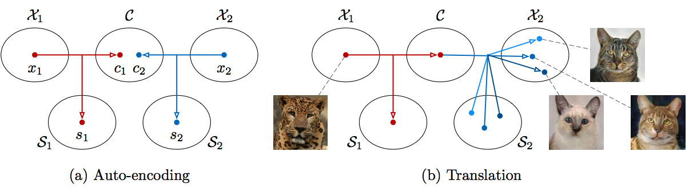
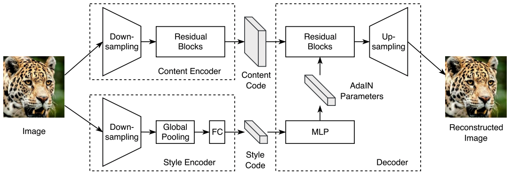
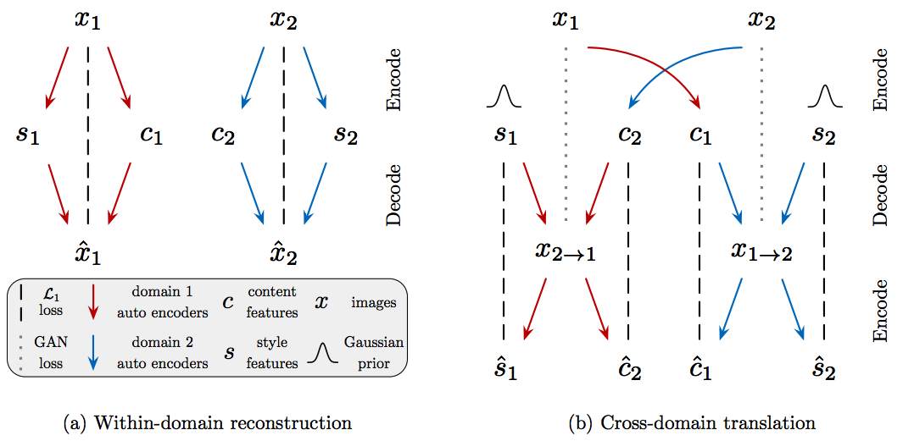

# MUNIT-Tensorflow
Simple Tensorflow implementation of ["Multimodal Unsupervised Image-to-Image Translation"](https://arxiv.org/abs/1804.04732)

## Requirements
* Tensorflow 1.4
* Python 3.6

## Usage
```bash
├── dataset
   └── YOUR_DATASET_NAME
       ├── trainA
           ├── xxx.jpg (name, format doesn't matter)
           ├── yyy.png
           └── ...
       ├── trainB
           ├── zzz.jpg
           ├── www.png
           └── ...
       ├── testA
           ├── aaa.jpg 
           ├── bbb.png
           └── ...
       └── testB
           ├── ccc.jpg 
           ├── ddd.png
           └── ...
```
### Train
* python main.py --phase train --dataset summer2winter

### Test
* python main.py --phase test --dataset summer2winter --num_style 3 --batch_size 1

## Summary


## Architecture 


## Model Overview


## Results
### Edges to Shoes/handbags Translation


### Animal Image Translation


### Street Scene Translation


### Yosemite Summer to Winter Translation (HD)


## Related works
* [CycleGAN-Tensorflow](https://github.com/taki0112/CycleGAN-Tensorflow)
* [DiscoGAN-Tensorflow](https://github.com/taki0112/DiscoGAN-Tensorflow)
* [UNIT-Tensorflow](https://github.com/taki0112/UNIT-Tensorflow)

## Reference
* [MUNIT-Pytorch](https://github.com/NVlabs/MUNIT)

## Author
Junho Kim
